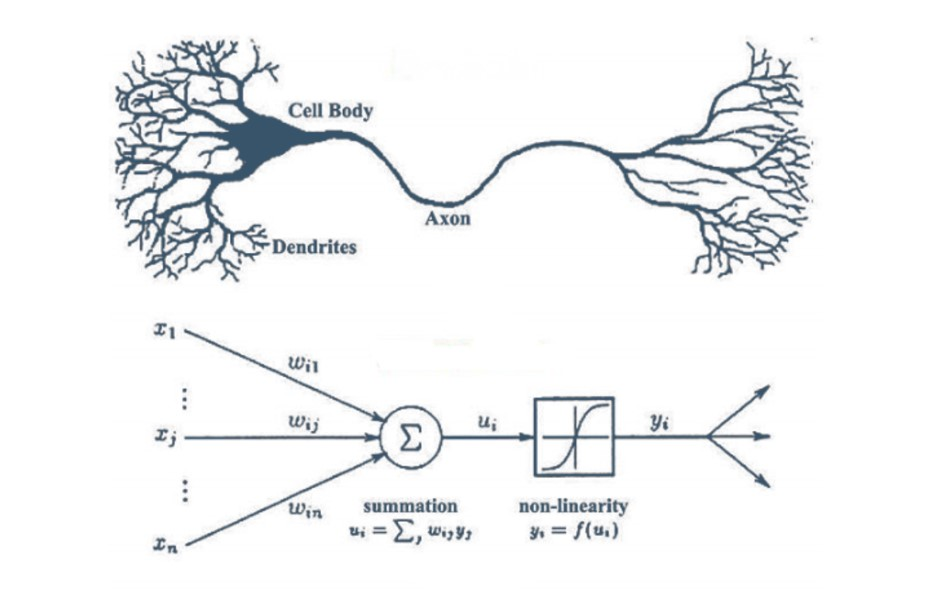

# RNA Feedforward



Laboratorio 1 - Machine Learning Avanzado

## Descripción del Proyecto

Este proyecto implementa un modelo de **Red Neuronal Artificial (RNA)** de tipo **feedforward** para clasificar la calidad de manzanas en base a sus características físicas y químicas. Utilizando un conjunto de datos de **Kaggle** llamado **Apple Quality**, este modelo busca predecir si una manzana cumple con los estándares de calidad, basado en atributos como el tamaño, peso, dulzura, crujiente, jugosidad, madurez y acidez.

## Estructura del Proyecto

1. **Preparación y Preprocesamiento de Datos**: 
   - Estandarización de variables para mejorar la convergencia del modelo.
   - División del conjunto de datos en conjuntos de entrenamiento y prueba (80%-20%).

2. **Implementación del Modelo de Red Neuronal Feedforward**:
   - Construcción de la arquitectura de la red neuronal, incluyendo capas ocultas con funciones de activación ReLU y una capa de salida con activación sigmoide para clasificación binaria.
   - Entrenamiento del modelo utilizando el optimizador Adam y la función de pérdida de entropía cruzada.

3. **Optimización de Hiperparámetros**:
   - Ajuste de parámetros clave como el número de neuronas, capas ocultas, tasa de aprendizaje y número de épocas para mejorar el rendimiento.

4. **Evaluación y Validación**:
   - Análisis de métricas de evaluación como precisión, sensibilidad y especificidad para validar el rendimiento del modelo.
   - Verificación de sobreajuste mediante la comparación del rendimiento en los conjuntos de entrenamiento y prueba.

5. **Resultados y Conclusiones**:
   - Presentación de los resultados obtenidos y discusión de las conclusiones del modelo aplicado a la clasificación de calidad de manzanas.

## Requisitos

Para ejecutar este proyecto, es necesario tener instaladas las siguientes librerías de Python:
- `numpy`
- `pandas`
- `scikit-learn`
- `tensorflow` o `keras`
- `matplotlib`
- `seaborn`

## Cómo Usar

1. **Clonar el repositorio**:
   ```bash
   git clone https://github.com/tuusuario/RNA_Feedforward.git
   cd RNA_Feedforward
